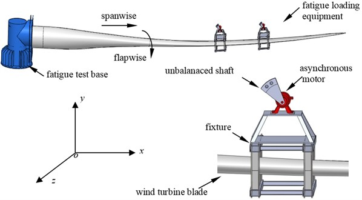
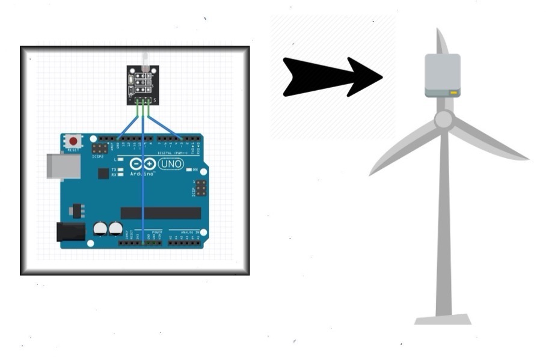

# windturbine-monitor

Strong winds cause dangerous flapwise vibrations of wind turbine blade, leading to the dangerous breaking of turbine blades. To prevent such phenomenon, blades are run through fatigue tests to label turbine durability, however such incidents of broken blades still occur, endangering the surroundings and costing a lot of money.

What if a small device could be mounted onto the turbine blade to monitor levels of blade fatigue in real-time so automated measures can be taken prior to excessive flapwise damage?

## The Solution

Using a hydrargyrum tilt module and an Arduino, we can monitor the forward tilt of the blade and signal an alert when the forward tilt of the blade is dangerously excessive.

